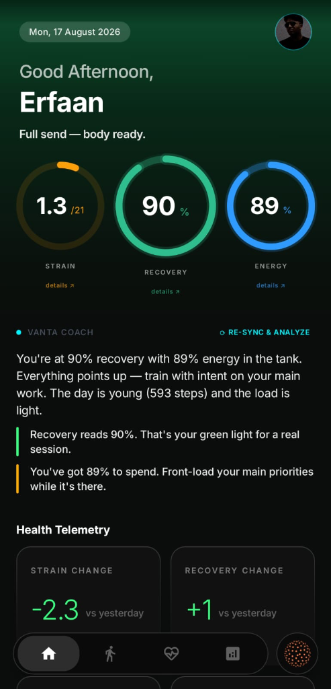
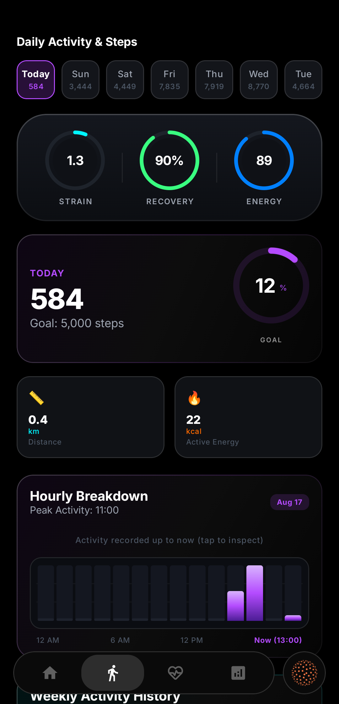
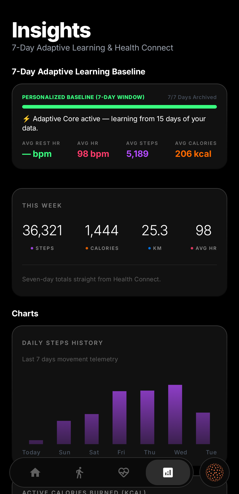
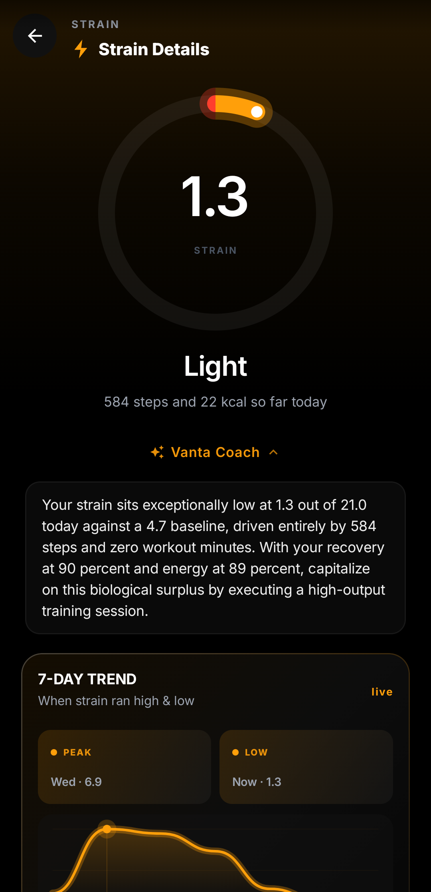
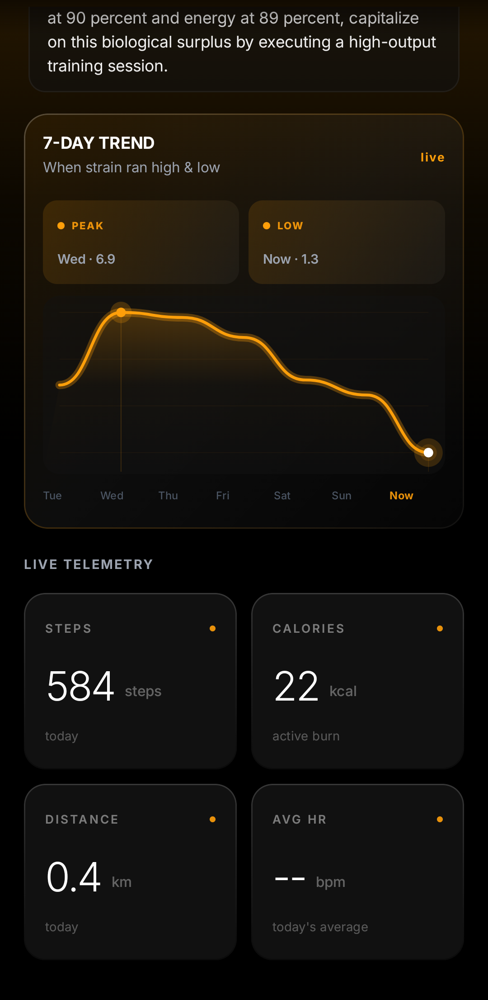
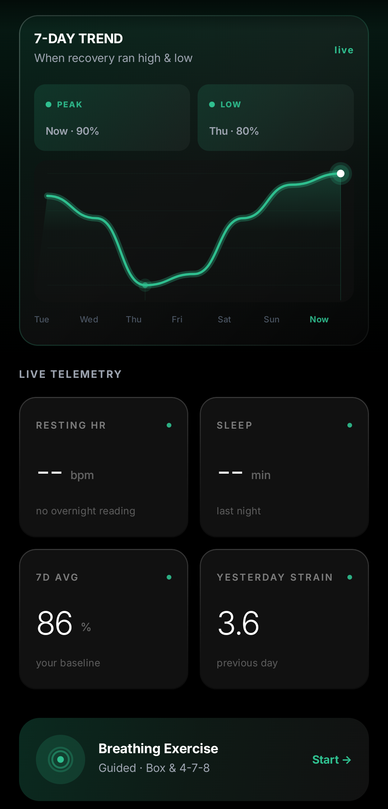

<div align="center">

# ⚡ VANTA
### WHOOP-style Recovery, Strain, and Health Tracking for Android

[](https://kotlinlang.org)
[](https://developer.android.com/jetpack/compose)
[](https://developer.android.com/health-and-fitness/guides/health-connect)
[](https://ai.google.dev)
[](https://ko-fi.com/H5I7258KQ2)

<br/>

**VANTA** brings WHOOP-style recovery, daily strain, and health intelligence to Android without expensive hardware or monthly subscriptions. It connects to **Google Health Connect** to pull data from whatever watch or fitness tracker you already use (Pixel Watch, Galaxy Watch, Garmin, Fitbit, etc.) and gives you clean, honest scores about your body.

</div>

---

> ⚠️ **Note: VANTA is still actively under development. You might encounter bugs, glitches, or rough edges as new updates roll out! Contributions, feature ideas, bug reports, and pull requests are very welcome — feel free to open an issue or submit a PR to help improve the app! 🚀**

---

## 📱 Screenshots

<div align="center">
<table>
  <tr>
    <td align="center" width="33%">
      
      <br/><b>Main Dashboard</b><br/>
      <sub>Live daily scores & AI Coach</sub>
    </td>
    <td align="center" width="33%">
      
      <br/><b>Steps & Activity</b><br/>
      <sub>7-day timeline & hourly movement</sub>
    </td>
    <td align="center" width="33%">
      
      <br/><b>Insights & Baselines</b><br/>
      <sub>Your 7-day personal averages</sub>
    </td>
  </tr>
  <tr>
    <td align="center" width="33%">
      
      <br/><b>Strain Details</b><br/>
      <sub>0–21 daily exertion breakdown</sub>
    </td>
    <td align="center" width="33%">
      
      <br/><b>7-Day Trend</b><br/>
      <sub>Peak and low markers over time</sub>
    </td>
    <td align="center" width="33%">
      
      <br/><b>Recovery & Breathwork</b><br/>
      <sub>Sleep scores & guided breathing</sub>
    </td>
  </tr>
</table>
</div>

---

## 🌟 What Does VANTA Do?

### 1. ⚡ Three Simple Scores Every Day
* **Recovery (0–100%)**: Tells you how ready your body is for the day based on your sleep stages and overnight resting heart rate.
* **Strain (0–21 Scale)**: Shows how hard your heart and body worked today from your daily steps, movement, and workouts.
* **Energy (0–100%)**: Gives you an estimate of how much energy you have left in the tank for the rest of the day.

### 2. 🧬 Biological Age Tracking
Your real age only goes up once a year, but your biological age changes with your sleep, fitness, and daily habits. VANTA calculates whether your body is trending younger or older based on:
* Overnight Resting Heart Rate
* Daily workout volume & steps
* Sleep and recovery quality
* Workout consistency over 30 days
* Training balance (not overworking or slacking off)
* Body Mass Index (BMI)

### 3. 🤖 AI Coach (No Robotic Talk)
VANTA includes a built-in AI Coach that talks to you like a real person. Ask it why your recovery dropped, whether you should work out today, or how to improve your score.
* **100% On-Device AI**: Runs local AI models (Gemma / Qwen via LiteRT) directly on your phone so your data never touches the internet.
* **Cloud AI Support**: You can also plug in your own Gemini or DeepSeek API key for extra detailed analysis.

### 4. 🫁 Guided Breathing
Built-in **Box Breathing (4-4-4-4)** and **4-7-8 Relaxing Breath** with haptic vibrations to help you wind down before bed or lower your heart rate after hard workouts.

### 5. 🔗 Works With Your Wearables
Pulls data directly through **Google Health Connect** — including steps, heart rate, sleep stages, active calories, and workouts (running, cycling, lifting, HIIT, swimming, etc.).

---

## 🔒 Privacy First

* **No subscriptions.**
* **No ads or trackers.**
* **All your health data stays on your phone** inside a local database.

---

## 🛠️ How to Build & Run

### Requirements
* Android Studio (Ladybug / Koala or newer)
* Android device running Android 8.0+ (with Google Health Connect installed)

### 1. Clone & Build
```bash
git clone https://github.com/erfaralabs/vanta.git
cd vanta

# Build debug APK
./gradlew assembleDebug

# Build release APK
./gradlew assembleRelease
```

### 2. Install on Device
```bash
adb install -r -d app/build/outputs/apk/release/app-release.apk
```

---

## 🤝 Contributing

VANTA is open-source and actively evolving. Whether you want to fix a bug, suggest a new metric, optimize on-device AI performance, or polish the UI:
1. **Fork the repository**
2. **Create a feature branch** (`git checkout -b feature/cool-idea`)
3. **Commit your changes** (`git commit -m 'feat: add cool feature'`)
4. **Push to the branch** (`git push origin feature/cool-idea`)
5. **Open a Pull Request**

All feedback, bug reports, and code contributions are appreciated!

---

## 🤖 Built with AI

This project was built and pair-programmed with AI assistants (Antigravity by Google DeepMind) to explore what's possible with rapid prototyping, on-device health intelligence, and native Android development.

---

## 💖 Support the Project

If you find **VANTA** helpful and want to support its ongoing development, feel free to buy me a coffee!

<div align="center">

[](https://ko-fi.com/H5I7258KQ2)

<sub>Every coffee helps keep the project open-source and independent. Thank you! ⚡</sub>

</div>

---

<div align="center">
  <sub>Built with AI & passion for honest health tracking on Android.</sub>
</div>
